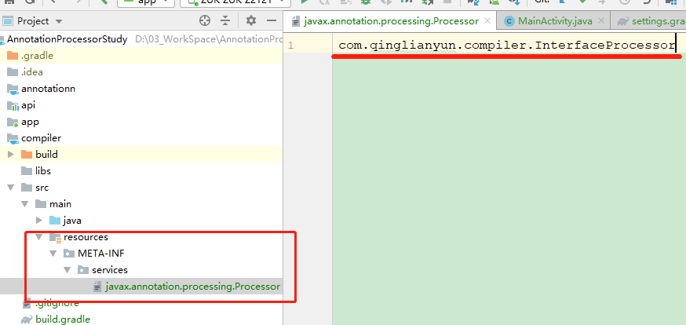

# 学习自定义注解处理器

## 相关学习
  - javapoet 代码生成框架
  - [编译期间动态生成代码](https://blog.csdn.net/u010126792/article/details/95614328)
  - 参考[EventBus](https://github.com/greenrobot/EventBus/blob/master/EventBusAnnotationProcessor/src/org/greenrobot/eventbus/annotationprocessor/EventBusAnnotationProcessor.java)
、[ARouter](https://github.com/alibaba/ARouter/tree/develop/arouter-compiler/src/main/java/com/alibaba/android/arouter/compiler/processor)

## 准备
  - api         操作注解API (java library / android library)
  - annotation  声明注解（java library）
  - compiler    自动生成java代码（java library）

## 使用
  
只有编译时发现注解，才会生成代码。读取到注解时，使用生成的代码代替

  1、首先创建声明的注解
  2、自定义注解处理器
  3、注册Processor（自定义Processor需要注册给java编辑器，编译时才能识别），在这里添加生成java文件的代码。生成java文件有三种方式：BufferedWriter、模板文件、javapoet

 ElementKind 元素类型（方法、成员变量、类等等） 相当于当前元素是包、类还是方法参数等等
 - PACKAGE 包
 - ENUM 枚举
 - CLASS 类
 - ANNOTATION_TYPE 注解
 - INTERFACE 接口
 - ENUM_CONSTANT 枚举常量
 - FIELD 字段
 - PARAMETER 方法参数
 - LOCAL_VARIABLE 局部变量
 - METHOD 方法
 - CONSTRUCTOR 构造方法
 - TYPE_PARAMETER 类型参数

 TypeMirror 是一个接口，表示Java编程语言中的类型。
 - ArrayType 表示数组类型
 - DeclaredType 表示声明类型(类或接口类型)
 - ErrorType 表示异常类或接口类型
 - ExecutableType 表示executable类型(方法、构造方法、初始化)
 - NoType 表示在实际类型不适合的地方使用的伪类型
 - NullType 表示null类型
 - PrimitiveType 表示基本数据类型
 - ReferenceType 表示引用类型
 - TypeVariable 表示类型变量
 - WildcardType 表示通配符类型参数

 TypeKind  类型的属性
 - BOOLEAN 基本类型boolean
 - INT 基本类型int
 - LONG 基本类型long
 - FLOAT 基本类型float
 - DOUBLE 基本类型double
 - VOID 对应于关键字void的伪类型
 - NULL null类型
 - ARRAY 数组类型
 - PACKAGE 对应于包元素的伪类型
 - EXECUTABLE 方法、构造方法、初始化
 - DECLARE 声明类型

### ElementKind、TypeMirror和TypeKind区别
    ElementKind 是告诉我们当前元素是包、类还是方法参数等等
    TypeMirror 这个元素是基本类型、引用类型，还是接口等等
    TypeKind   则是TypeMirror类型的具体属性，例如基本类型是int、long和float等等；引用类型的

ElementKind TypeMirror,TypeKind  ElementType

# 遇到的错误
- [编译无法生成注解类](https://www.jianshu.com/p/88d620757666)

    自动注册Processor没有起作用，暂时没有找到什么原因。

    解决方案：没有注册注解信息，在compiler项目下添加compiler/src/main/resources/META_INF/services，在 services 目录下面创建一个名字为 “javax.annotation.processing.Processor” 的文本文件：

    

- Compilation failed; see the compiler error output for details.

    解决方案：尽管没有知道具体原因，但当前是Processor中的error()没有用正确。
    可以使用命令来查看详情：gradlew app:xxx  --stacktrace -info  或 gradlew app:xxx  --stacktrace -debug 或 gradlew app:xxx  --scan
- 其他

   如果有错误可能还需要添加：

        javaCompileOptions{

            annotationProcessorOptions.includeCompileClasspath = true

        }

# 应用场景
    - 信息收集与统计（编译时权限检查或统计；运行时数据收集或统计）
    - 事件代理（例如Butterknife，通过生成的代码代理view查找；其他属性跨域初始化赋值）
    - 动态代理或代码插入

# javapoet的使用
### 基本用法
 
MethodSpec 用于生成方法
 TypeSpec   用于生成类、接口、枚举对象的类
 JavaFile java代码

### 三种占位符
    $T  主要将class抽象出来，用传入的TypeName指向的Class来代替
    $N  在JavaPoet中代指一个名称，例如：方法名称、变量名称
    $S 和 $L  $S替换后的内容自带双引号，$L不带双引号

# 如何选择合适的Map
- HashMap可实现快速存储和检索，但其缺点是其包含的元素是无序的，这导致它在存在大量迭代的情况下表现不佳。
- LinkedHashMap保留了HashMap的优势，且其包含的元素是有序的。它在有大量迭代的情况下表现更好。
- TreeMap能便捷的实现对其内部元素的各种排序，但其一般性能比前两种map差。

**LinkedHashMap映射减少了HashMap排序中的混乱，且不会导致TreeMap的性能损失。**

